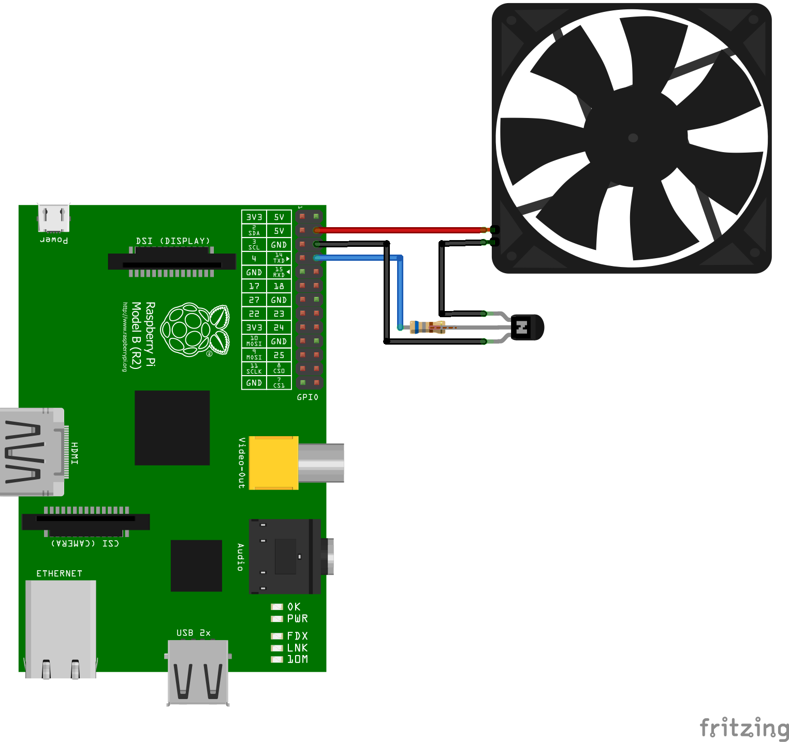

# RPi-Fan-Controller
System service for controlling CPU fan connected via GPIO pins for RaspberryPi.

## Installation
### From Source

 1. Install packages required packages

> sudo apt-get install cmake git

 2. Clone repository to local
> git clone https://github.com/Devil7-Softwares/RPi-Fan-Controller.git

 3. Configure cmake
> cmake -B build --configure .

 4. Build source files
 > cmake --build ./build
 
 5. Install service to system
 > sudo cmake --build ./build --target install
 
 6. Start service. (In future boots service will be started automatically)
 > sudo systemctl start fancontroller
 7. Vertify status of service
 > sudo systemctl status fancontroller

## Configuration
  Configurations are stored in plain text format file `/etc/rpifc.cfg` in **KEY=VALUE** format. On first run, the service will create a default configuration file which can be edited by the user.

1. Open the configuration file
> sudo nano /etc/rpifc.cfg
2. Edit values
3. Save the changes by pressing `Ctrl+O` and `Enter`
4. Close the editor using `Ctrl+X`
5. Restart the service
> sudo systemctl restart fancontroller
 
 ### Available configurations

|Key|Description|DefaultValue|
|--|--|--|
|ON_TEMP|Temprature threshold to turn on the fan|50|
|OFF_TEMP|Temprature threshold to turn off the fan|40|
|INTERVAL|Interval in seconds to check the temprature|5|
|GPIO_PIN|GPIO control pin the fan is connected (Check the circuit below)|14|

## Circuit
### Parts

 - 5V DC Fan
 - 2N2222 Transistor
 - 680Ω Resistor

### Diagram

### Connections
<table>
	<tr>
		<td>Raspberry Pi 5v</td>
		<td></td>
		<td>Fan 5v</td>
	</tr>
	<tr>
		<td>Raspberry Pi GND</td>
		<td></td>
		<td>Transistor Emitter</td>
	</tr>
	<tr>
		<td>Raspberry Pi GND</td>
		<td></td>
		<td>Transistor Emitter</td>
	</tr>
	<tr>
		<td>Raspberry Pi GPIO Pin 14 (Configurable)</td>
		<td>680Ω Resistor</td>
		<td>Transistor Base</td>
	</tr>
	<tr>
		<td>Fan GND </td>
		<td></td>
		<td>Transistor Collector</td>
	</tr>
</table>